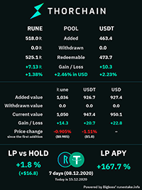

# THORChain Infobot

This is a telegram bot to monitor some aspects of THORChain. It can also generate liquidity pool reports for you. Like
this:

[](https://raw.githubusercontent.com/tirinox/thorchainmonitorbot/master/misc/example_report.jpeg)

## Live bot

[Start the bot in Telegram](https://t.me/thor_infobot)

[Twitter Automated account](https://twitter.com/THOR_InfoBot)

## Commands

```/start``` – run the bot  
```/price``` – Rune's price

*To do: describe the rest of commands.*

Inline command `@bot ADDRESS POOL` to make a LP card for ADDRESS providing liquidity to POOL, POOL may not be exact but
short like BTC or TOKEN-0x443.

## Installation

0. Clone this repo
1. Install [Docker](https://docs.docker.com/engine/install/)
   and [Docker Compose](https://docs.docker.com/compose/install/)
2. Copy `example.env` to `.env`
3. Edit `REDIS_PASSWORD` in `.env`
4. Copy `example_config.yaml` to `config.yaml`
5. Edit there the parameter: `telegram.bot.token` (get it from @BotFather)
6. Edit there `telegram.channels.name` (your bot must be admin for that channel!)
7. Run `make start` and wait until the bot is build and run inside Docker

In brief:

```
cp example.env .env
nano .env
cp example_config.yaml config.yaml
nano config.yaml
make start
```

### Optional Dev things

1. For deep performance profiling
`pip install line-profiler-pycharm`
2. Run DB server locally:
```
cd redis-data 
redis-server
```


### Caveats

1. If you cannot debug on Python 3.10+, try uninstalling uvloop package `pip uninstall uvloop`. It helped me.
2. If you use PyCharm, please mark directory "app" as a source root.
3. If you experience problems with Redis, try to run analytics script and clean the database if it is too heavy.
```bash
make attach
PYTHONPATH="/app" python tools/redis_analytics.py /config/config.yaml
PYTHONPATH="/app" python tools/cleanup_tx_db.py /config/config.yaml
```

cleanup_tx_db script will remove all transactions older than 30 days.

### Adding a new affiliate

Please refer to the [NewAffiliate.md](docs/NewAffiliate.md) guide for instructions on how to add a new affiliate to the bot.