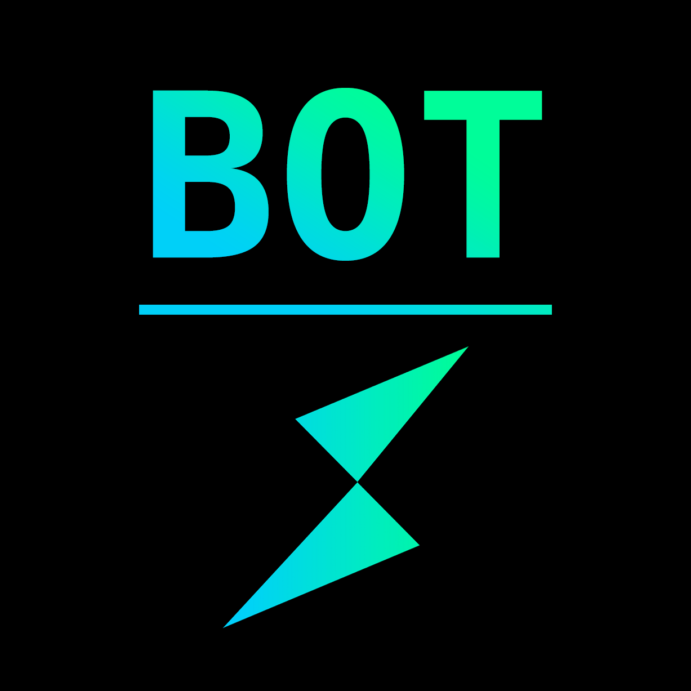
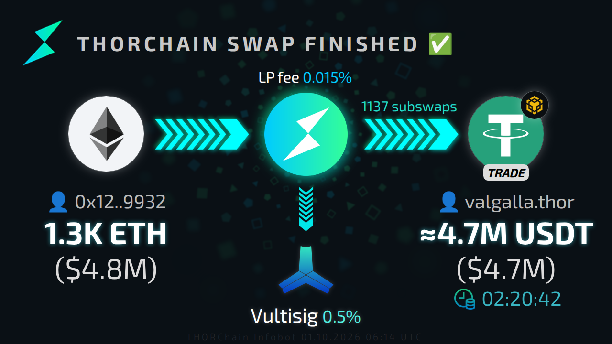
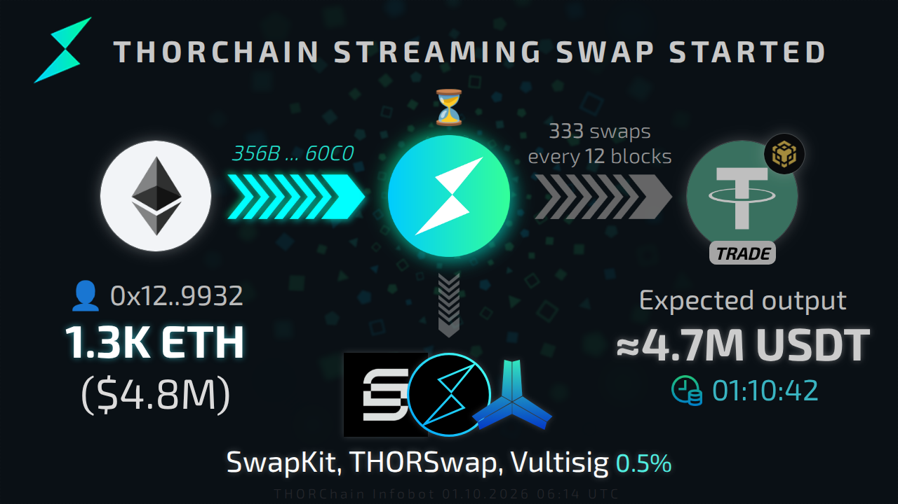
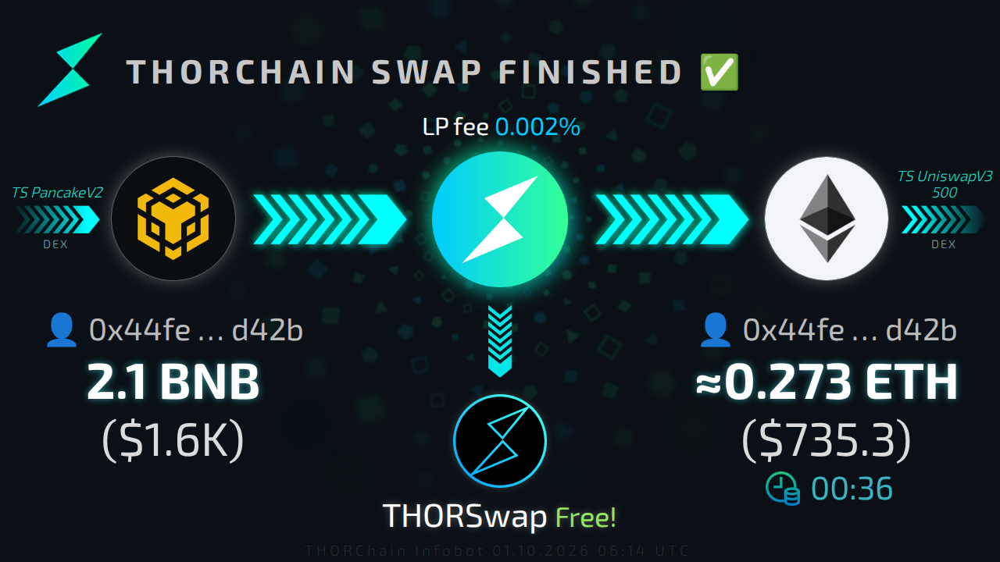
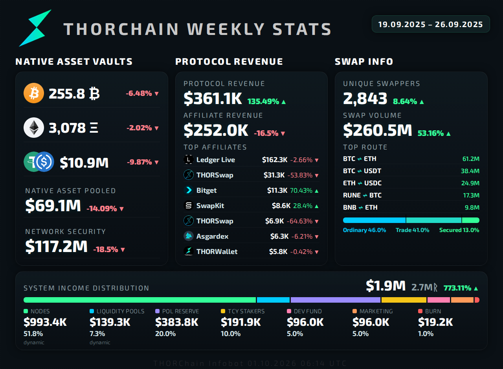
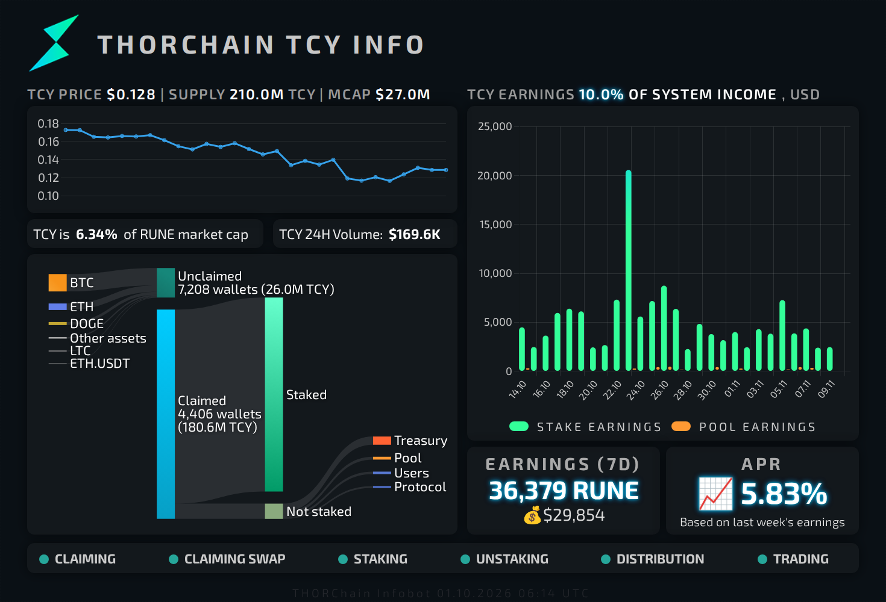
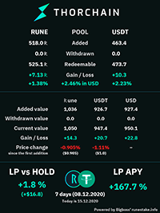
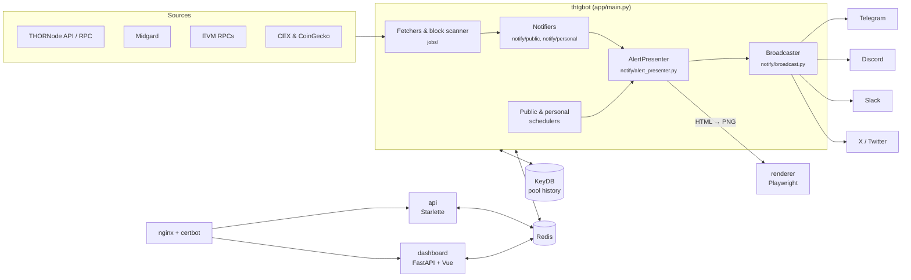

<div align="center">



# THORChain Infobot

**Real-time THORChain monitoring, alerts and infographics for Telegram, Discord, Slack and X (Twitter).**

[](https://www.python.org/)
[](docker-compose.yml)
[](#architecture)
[](LICENSE)

[**Telegram bot**](https://t.me/thor_infobot) · [**Alert channel**](https://t.me/thorchain_alert) · [**X / Twitter**](https://twitter.com/THOR_InfoBot) · [**Node operator settings**](https://settings.thornode.org)



</div>

---

## Contents

- [What it does](#what-it-does)
- [Gallery](#gallery)
- [Architecture](#architecture)
- [Quick start](#quick-start)
- [Configuration](#configuration)
- [Telegram commands](#telegram-commands)
- [Admin dashboard](#admin-dashboard)
- [Local development](#local-development)
- [Operations and maintenance](#operations-and-maintenance)
- [Extending the bot](#extending-the-bot)
- [Project layout](#project-layout)
- [Troubleshooting](#troubleshooting)
- [License](#license)

---

## What it does

The bot watches THORChain through THORNode and Midgard, scans every block, and turns what it sees into
human-readable alerts and rendered infographics. It serves three audiences at once:

### 📣 Public alerts (broadcast to channels)

| Area | Examples |
|---|---|
| **Swaps & transactions** | Large swaps, streaming swap start/finish, trade-asset swaps, DEX aggregator usage, refunds, donations, add/withdraw liquidity — thresholds scale with pool depth via a configurable curve |
| **Price** | RUNE price moves, all-time highs, price divergence between pools and CEXs |
| **Network** | Node churn, pool churn, chain halts and recovery, outbound/internal/swap queue congestion, new chain IDs |
| **Governance** | Mimir changes, node-Mimir voting progress, upgrade proposals and version rollout |
| **Capital flows** | Large RUNE transfers, CEX in/out flow summaries, RUNEPool deposits/withdrawals, trade accounts |
| **Supply** | RUNE supply breakdown, burned RUNE and income charts |
| **Ecosystem** | Secured assets, TCY, CosmWasm app-layer stats, limit swaps, rapid swaps |
| **Achievements** | Milestones such as record volume, users, or pool depth |

### 🗓️ Scheduled reports

Recurring summaries run on a cron/interval/one-off schedule managed from the [admin dashboard](#admin-dashboard):
weekly key metrics, top pools, supply chart, RUNE burn, price, network stats, POL (ADR-024), RUNEPool,
trade assets, secured assets, TCY, app-layer stats, limit swaps, rapid swaps and RUNE transfer stats.

### 👤 Personal tools (Telegram DMs)

- **My wallets** — follow any address: liquidity positions with P&L/IL infographics, balances, bond provider
  stats, balance-change alerts and scheduled LP reports.
- **Node operator tools** — watch your THORNodes and get notified about going offline, chain height lag,
  slash points, version updates, IP changes, churn in/out and bond changes. Settings can also be edited on the
  [web page](https://settings.thornode.org).
- **Price divergence** alerts and language selection (English / Russian).

---

## Gallery

Infographics are HTML/Jinja2 templates rendered to images by the `renderer` service, so every alert looks the
same in Telegram, Discord, Slack and on X.

<table>
  <tr>
    <td width="50%"><br/><sub><b>Streaming swap started</b>: route, sub-swap schedule, affiliates, expected output and ETA</sub></td>
    <td width="50%"><br/><sub><b>Swap finished</b> with DEX aggregator legs decoded on both sides</sub></td>
  </tr>
  <tr>
    <td><br/><sub><b>Weekly stats</b>: vaults, protocol and affiliate revenue, swappers, top routes, income distribution</sub></td>
    <td><br/><sub><b>TCY info</b>: price, claiming and staking flows, earnings and APR</sub></td>
  </tr>
  <tr>
    <td colspan="2" align="center"><a href="docs/misc/example_report.jpeg"></a><br/><sub><b>Personal liquidity report</b> for a followed wallet</sub></td>
  </tr>
</table>

All templates and their sample data live in `app/renderer/templates/` and `app/renderer/demo/`. With the renderer
running, open http://localhost:8404/render/demo to browse every demo as HTML or PNG.

---

## Architecture


```mermaid
flowchart LR
    subgraph Sources
        TN[THORNode API / RPC]
        MG[Midgard]
        W3[EVM RPCs]
        CEX[CEX & CoinGecko]
    end

    subgraph Bot["thtgbot (app/main.py)"]
        F[Fetchers & block scanner<br/><sub>jobs/</sub>] --> N[Notifiers<br/><sub>notify/public, notify/personal</sub>]
        N --> P[AlertPresenter<br/><sub>notify/alert_presenter.py</sub>]
        P --> B[Broadcaster<br/><sub>notify/broadcast.py</sub>]
        S[Public & personal<br/>schedulers] --> P
    end

    Sources --> F
    P -- HTML → PNG --> R[renderer<br/>Playwright]
    B --> TG[Telegram]
    B --> DC[Discord]
    B --> SL[Slack]
    B --> TW[X / Twitter]

    Bot <--> RD[(Redis)]
    Bot <--> KD[(KeyDB<br/>pool history)]
    API[api<br/>Starlette] <--> RD
    DASH[dashboard<br/>FastAPI + Vue] <--> RD
    NGINX[nginx + certbot] --> API
    NGINX --> DASH
```

The bot is **event-driven**: fetchers and decoders publish events to a chain of subscribers (`add_subscriber`),
notifiers decide whether something is alert-worthy, and the presenter/broadcaster layer formats and fans the message
out to every configured channel in its language. Shared runtime state lives in a single dependency container,
`app/lib/depcont.py` (`DepContainer`).

### Services (`docker-compose.yml`)

| Service | Role | Port (localhost only) |
|---|---|---|
| `thtgbot` | The bot itself: fetchers, scanner, notifiers, Telegram/Discord/Slack/Twitter clients, schedulers | — |
| `renderer` | Renders Jinja2/HTML infographics to images with Playwright/Chromium (`app/renderer/`) | `8404` |
| `api` | Public web API (Starlette) for node-operator settings, stats, names and Slack OAuth | `8077` |
| `dashboard` | Admin dashboard: FastAPI JSON API + Vue 3 / PrimeVue SPA | `8501` |
| `redis` | Primary persistent state (settings, caches, dedup, scheduler config, FSM) | `$REDIS_PORT` |
| `keydb` | Pool-state history cache | `$KEYDB_PORT` |
| `nginx` | Public entry point: frontend, `/api/`, `/slack/`, `/dashboard/`, `/logs/` with TLS | `80`, `443` |
| `certbot` | Renews the Let's Encrypt certificate every 12 h | — |
| `dozzle` | Container log viewer, exposed via nginx at `/logs/` | `8888` |

### Startup sequence

`App.run_bot` performs `on_startup → _run_background_jobs → create_thor_node_connector → _prepare_task_graph → _preloading`.
Preloading gates readiness: Redis ping, last block, pool cache, nodes and Mimir are loaded **before** the public
scheduler starts, so no alert is ever built from empty data. Run `make graph` to render the live
fetcher → notifier graph to `graph.png`.

---

## Quick start

**Requirements:** [Docker](https://docs.docker.com/engine/install/) with the Compose plugin, `make`, and a Telegram
bot token from [@BotFather](https://t.me/BotFather).

```bash
git clone https://github.com/tirinox/thorchainmonitorbot.git
cd thorchainmonitorbot

cp example.env .env                     # set REDIS_PASSWORD, KEYDB_PASSWORD, DOMAIN, …
cp example_config.yaml config.yaml      # set telegram.bot.token, broadcasting.channels, …

make start
make logs
```

Minimum edits in `config.yaml`:

1. `telegram.bot.token` and `telegram.bot.username`.
2. `telegram.admins` — your Telegram user ID(s).
3. `broadcasting.channels` — where public alerts go. For Telegram channels the bot must be an **admin**.
4. Disable integrations you don't use: `discord.enabled`, `slack.enabled`, `twitter.enabled`.

> [!TIP]
> Without a domain or certificate, set `NGINX_CFG_NAME=nginx-test.conf` in `.env` to run nginx over plain HTTP.

---

## Configuration

Configuration is split between **`.env`** (secrets and infrastructure, read by Docker Compose and the app) and
**`config.yaml`** (behaviour). `Config` auto-loads `.env` and looks for the YAML at the path given as the first
CLI argument, then `/config/config.yaml`, `../config.yaml`, and `config.yaml`.

### `.env`

| Variable | Purpose |
|---|---|
| `REDIS_HOST`, `REDIS_PORT`, `REDIS_PASSWORD`, `REDIS_DB_INDEX` | Primary Redis |
| `KEYDB_HOST`, `KEYDB_PORT`, `KEYDB_PASSWORD`, `KEYDB_DB_INDEX` | KeyDB for the pool history cache |
| `DOZZLE_USERNAME`, `DOZZLE_PASSWORD`, `DOZZLE_KEY`, `DOZZLE_TAILSIZE` | Log viewer |
| `DOMAIN`, `LETS_ENCRYPT_EMAIL` | TLS certificate |
| `NGINX_CFG_NAME` | `nginx.conf` (production, TLS) or `nginx-test.conf` (plain HTTP) |

### `config.yaml`

[`example_config.yaml`](example_config.yaml) is the annotated reference. The main sections:

| Section | What it controls |
|---|---|
| `thor` | THORNode / RPC / archive / Midgard endpoints, timeouts, stable coins |
| `web3` | EVM RPCs (ETH, AVAX, BSC, BASE) used to decode DEX aggregator swaps |
| `telegram`, `discord`, `slack`, `twitter` | Platform credentials and toggles (`twitter.max_length` depends on X Premium) |
| `broadcasting` | Output channels (`type`, `name`, `lang`), startup quiet period, optional `test_channels` |
| `tx` | Swap / liquidity / donate / refund thresholds, depth curve, streaming swap watchlist |
| `price`, `supply`, `cap`, `queue`, `node_info`, `constants`, … | One section per alert family, each with `enabled`, fetch period and cooldowns |
| `native_scanner` | Block scanner, CosmWasm and limit-swap recording, excluded addresses |
| `node_op_tools`, `personal` | Personal node watcher, watchdog, rate limits, personal scheduler |
| `names` | THORName resolution and well-known address labels (affiliates live in `app/data/affiliates.yaml`) |
| `infographic_renderer` | HTML renderer URL (default `http://renderer:8404/render`) |
| `web`, `dashboard` | API and dashboard host/port |
| `sentry`, `logs` | Error reporting and log level/style (`normal`, `json`, `colorful`) |

Every alert family is a config-driven feature toggle (`<section>.enabled`). Durations accept human-friendly values
like `10m`, `12h`, `7d`.

Broadcast channel languages: `eng`, `rus`, and `eng-tw` (English tuned for X/Twitter length and style).

---

## Telegram commands

| Command | Description |
|---|---|
| `/start` | Start or restart the bot, open the main menu |
| `/lang` | Choose the language |
| `/lp`, `/wallets` | Wallets you follow: LP positions, balances, bonds |
| `/price` | RUNE price chart |
| `/stats` | THORChain network stats |
| `/weekly` | Weekly key statistics |
| `/pools` | Top pools |
| `/pol` | Protocol-owned liquidity |
| `/supply` | RUNE supply chart |
| `/burnedrune` | Burned RUNE and income |
| `/queue` | Transaction queue |
| `/nodes` | THORNode list |
| `/chains` | Connected blockchains and their status |
| `/mimir` | Mimir constants |
| `/voting` | Node-Mimir voting |
| `/cexflow` | RUNE flow to/from CEXs |
| `/tradeacc` | Trade accounts |
| `/secured` | Secured assets |
| `/tcy` | TCY info |
| `/applayer` | CosmWasm app-layer stats |
| `/limitswaps` | Limit swap stats |
| `/rapid` | Rapid swap stats |
| `/help` | Help |

Admins (`telegram.admins`) additionally get `/debug` and an admin menu. The list for @BotFather is in
[`docs/misc/commands.txt`](docs/misc/commands.txt).

---

## Admin dashboard

A separate process (`app/dashboard_api.py`) with a Vue 3 + PrimeVue 4 frontend in [`web/dashboard`](web/dashboard),
served by nginx at **`/dashboard/`** behind basic auth. It talks to the bot only through Redis.

- **Home** — health checks: scanner lag, stale fetchers, failing or overdue jobs, unapplied config, recent errors.
- **Jobs & calendar** — create, edit, enable and schedule public reports (cron, interval, one-off); week view of
  upcoming posts with collision warnings.
- **Run now** — in three modes: *normal* (real post), *preview* (render without sending), or *test* (post only
  to `broadcasting.test_channels`). Previews and test sends never touch the "previous state" used by real alerts.
- **Live updates** — the bot publishes events to Redis (`Dashboard:Events`), streamed to the browser over SSE.
- **Flags** — toggle feature flags (`Flagship`) at runtime.
- **Activity** — audit log of every change with the acting user; deleted jobs and flag changes can be restored.

Manage basic-auth users with `make web-auth-add-user`. Details: [`web/dashboard/README.md`](web/dashboard/README.md).

---

## Local development

```bash
python3.12 -m venv .venv && source .venv/bin/activate
pip install -r app/requirements.txt
pip install discord.py --no-dependencies

docker compose up -d redis keydb renderer   # or run redis-server locally
cd app
PYTHONPATH=. python main.py ../config.yaml
```

For local runs point `REDIS_HOST` / `KEYDB_HOST` in `.env` to `localhost` and set
`infographic_renderer.renderer_url` to `http://localhost:8404/render`.

| Task | Command |
|---|---|
| Run tests | `make test` (= `cd app && python -m pytest tests`) |
| Renderer with auto-reload | `make renderer-dev` (templates in `app/renderer/templates`, sample data in `app/renderer/demo`) |
| Dashboard API with auto-reload | `make dashboard-dev` |
| Dashboard frontend with HMR | `make dashboard-front-dev` → http://localhost:5173/dashboard/ |
| Build the dashboard frontend | `make dashboard-build` |
| Render the event graph | `make graph` |
| Authorise the X/Twitter account | `make auth_twitter` |

Tips:

- In PyCharm, mark `app/` as a sources root.
- If debugging fails on Python 3.10+, try `pip uninstall uvloop`.
- For line-level profiling: `pip install line-profiler-pycharm`.
- Tests are mostly unit tests with `pytest-asyncio`; add new ones under `app/tests/`.

---

## Operations and maintenance

`make help` lists every target. The most used:

| Command | Action |
|---|---|
| `make start` / `stop` / `restart` | Manage all containers |
| `make poke` | `git pull` and restart bot, API, renderer, dashboard and nginx without touching the databases |
| `make upgrade` | Pull, rebuild images and start |
| `make build` | Rebuild bot, API, Redis and dashboard images (the renderer is rebuilt separately) |
| `make logs` / `make attach` | Follow bot logs / open a shell in the bot container |
| `make redis-cli` / `make keydb-cli` | Database shells |
| `make backup-db` / `make backup-keydb` | Timestamped copies of the dump files |
| `make redis-analysis` | Find what takes space in Redis |
| `make certbot` / `make certbot-test` | Issue the first TLS certificate / dry-run renewal |
| `make frontend-build` / `make frontend-rollback` | Deploy or roll back the node-operator site |
| `make restore-vote-data` | Rebuild Mimir vote history from past blocks |
| `make fill-pool-cache`, `make thin-out-pool-cache` | Maintain the KeyDB pool history |

One-off scripts in `app/tools/` run inside the container against live data:

```bash
make attach
PYTHONPATH="/app" python tools/redis_analytics.py /config/config.yaml
PYTHONPATH="/app" python tools/cleanup_tx_db.py /config/config.yaml   # drops transactions older than 30 days
```

---

## Extending the bot

- **New public alert from a stream of events** — write a fetcher in `app/jobs/fetch/` (or a block-scanner stage in
  `app/jobs/scanner/`), a notifier in `app/notify/public/`, and chain them in `_prepare_task_graph` behind a
  `<section>.enabled` toggle. Insert stages into the subscriber chain rather than bypassing existing notifiers.
- **New scheduled report** — add a job function to `PublicAlertJobExecutor` and register it in `AVAILABLE_TYPES`
  (`app/notify/pub_configure.py`). Save comparison state only via `_save_state` and send only via `_send_alert`,
  so previews and test sends stay side-effect free. It then shows up in the dashboard.
- **New infographic** — add a Jinja2 template to `app/renderer/templates/` and sample JSON to `app/renderer/demo/`.
- **Texts** — every message is localized in `app/comm/localization/` (`eng_base.py`, `rus.py`, `twitter_eng.py`).
- **New config key** — read it with `cfg.get(...)` / `as_*` helpers with a default, and document it in
  `example_config.yaml`.
- **New affiliate** — see [`docs/NewAffiliate.md`](docs/NewAffiliate.md).

More guidance for contributors and coding agents is in [`AGENTS.md`](AGENTS.md).

---

## Project layout

```
.
├── app/
│   ├── main.py              # bot entry point (App.run_bot)
│   ├── web_api.py           # public web API
│   ├── dashboard_api.py     # admin dashboard API
│   ├── api/                 # THORNode, Midgard, Maya, web3 connectors
│   ├── jobs/                # fetchers, block scanner, recorders, achievements
│   ├── notify/              # public & personal notifiers, presenter, broadcaster, schedulers
│   ├── comm/                # Telegram, Discord, Slack, Twitter clients; dialogs; localization; pictures
│   ├── dashboard/           # FastAPI dashboard backend
│   ├── renderer/            # HTML → image renderer service and templates
│   ├── models/              # data models
│   ├── lib/                 # config, DB, DepContainer, scheduler, utilities
│   ├── data/                # fonts, images, affiliates, Mimir naming
│   ├── tools/               # maintenance scripts
│   └── tests/               # pytest suite
├── web/
│   ├── dashboard/           # Vue 3 dashboard frontend
│   ├── frontend/            # built node-operator site (from nodeop-settings)
│   └── nginx.conf           # reverse proxy config
├── docs/                    # extra docs and samples
├── art/                     # logos and design sources
├── docker-compose.yml
├── Makefile
├── example.env
└── example_config.yaml
```

---

## Troubleshooting

- **Redis is slow or huge** — run `make redis-analysis`, then `tools/cleanup_tx_db.py` (see above).
- **Infographics fail to render** — check `docker compose logs renderer`. The `playwright` pip version must equal
  the Playwright base image version in `app/renderer/Dockerfile-renderer`; bump `PLAYWRIGHT_VERSION` there only.
- **Nothing is posted right after start** — expected: `broadcasting.startup_delay` silences the first burst of
  events after a restart.
- **A scheduled report changed but nothing happened** — press **Apply** in the dashboard; edits are saved as dirty
  until the bot reloads its scheduler.
- **Telegram channel posts fail** — the bot must be an admin of the channel.

---

## License

[MIT](LICENSE) © TRX.
Uses [TradingView Lightweight Charts™](https://www.tradingview.com/) — see [NOTICE](NOTICE).
